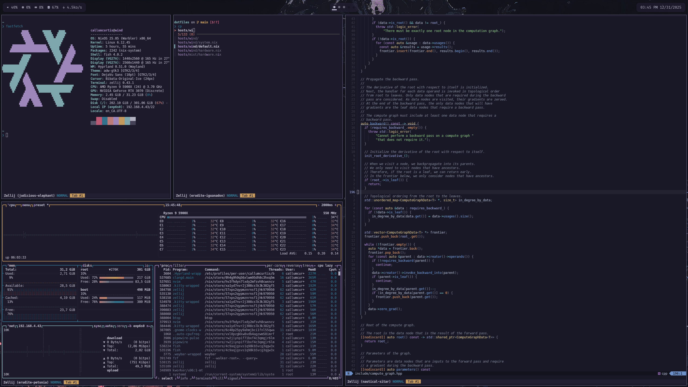

# dotfiles



My Linux configuration. An opinionated, modular, and ergonomic setup.

## Under the Hood

Uses the [Nix](https://nixos.org/guides/how-nix-works/) programming language and package manager for reproducible builds,
[NixOS](https://nixos.org/guides/how-nix-works/) for declarative system configuration,
and [Home Manager](https://nix-community.github.io/home-manager/) for declarative user environment configuration.

These tools come with some advantages:

- My system and user environments are fully described (explicitly and declaratively) within this repository - allowing my personal laptop, personal desktop, and work laptop to be configured identically
- Whenever I make a change to my configuration, I can create a new [system generation](https://nixos.wiki/wiki/Overview_of_the_NixOS_Linux_distribution#Generations), and rollback to an old generation at any time (no risk of broken changes)
- Using `nix-shell`, I can create temporary environments with any packages I want, without polluting my machine - this extends to projects, where project-specific Nix flakes can specify the exact packages required, with no risk of colliding with dependencies for other projects
- Whereas other package managers require you to remember to manually uninstall unused packages, the declarative nature of NixOS and Home Manager means that unused packages are easier to identify, and when something is deleted from the configuration, it is automatically removed from the environment

## Getting Started

The following instructions assume you're using NixOS. You can still use the Home Manager configuration if you're using a different OS (instructions for this use case will be added in the future).

1. Clone this repo
2. Symlink your `/etc/nixos/` folder to the cloned repo
3. Update the [defaults](./constants/default.nix) as you like
3. Run `sudo nixos-rebuild test --flake .#<hostname> --override-input wallpapers <input>`
&mdash; where `<hostname>` is the name of the host configuration you'd like to apply
and `<input>` is an input specifier for your wallpapers &mdash;
from the root of the cloned repo to temporarily apply the configuration
4. Once happy with the changes, use
`sudo nixos-rebuild switch --flake .#<hostname> --override-input wallpapers <input>`
to apply the configuration as a new system generation

Afterward, you won't need to include `--flake .#<hostname>` in the `nixos-rebuild`
commands (unless you want to use a different `<hostname>`).

## Useful (But Excluded) Utilities

Utilities for development have been excluded from these dotfiles. This way, project flakes are responsible
for defining their own utilities. For example, `btop` is included in these dotfiles as it is useful in multiple contexts,
even outside of development, whereas `hyperfine` has been excluded as it is typically used to benchmark a project during
development, and is better defined in the project's flake.

- [entr](https://github.com/eradman/entr): run arbitrary commands when files change
- [flamegraph](https://github.com/callumcurtis/snippets/tree/main/topic/profiling/flamegraph): opinionated stack trace visualizer
- [hyperfine](https://github.com/sharkdp/hyperfine): command-line benchmarking tool
- [tokei](https://github.com/XAMPPRocky/tokei): code statistics

## Useful Keymaps

### In Neovim

For simplicity, the examples below are not fully templated with different normal-mode commands.
You can easily substitute, for example, `vS` with `dS` to achieve different effects.

**normal mode**

- `s<query>`: jump to query position
- `cr<query>`: start `c` at query position
- `vS`: start `v` using Treesitter selection
- `vR<query>`: start `v` using Treesitter selection at query position
- `ci"<BS>'<CTRL-p>`: replace double-quote delimiters with single-quote delimiters
- `vif`: inner visual selection of function
- `vic`: inner visual selection of class
- `]f`: goto next function
- `]c`: goto next class

**insert mode**

- `CTRL-P`: paste from system clipboard

### In Fish

- `<ALT-e>`: edit the command in an nvim buffer
- `<CTRL-X>`: copy the current command line to the system clipboard

### In Zellij

- `<ALT-s>` -> `e`: open the scrollback buffer in Neovim

## Troubleshooting

**"no space left on device"**

If you get a "no space left on device" error message indicating a full boot drive when attempting to run a `nixos-rebuild switch` command, you may need to remove old/unused linux kernels from `/boot/EFI/nixos`. Make sure to leave the kernel used by the current system generation intact.

**boot manager disappears**

This will happen occasionally when dual-booting with Windows, as Windows updates may mess with your EFI partition and cause the NixOS boot manager to disappear.

1. [Download](https://nixos.org/download/) a minimal ISO image for NixOS
2. [Copy](https://nixos.org/manual/nixos/stable/#sec-booting-from-usb-linux) the ISO onto a thumb-drive
  ```
  sudo dd if=<path-to-image> of=/dev/<device> bs=4m
  ```
3. Insert the thumb-drive into the computer that you want to recover the boot manager on and swap the boot order in your BIOS to prioritize the thumb-drive
4. Select the Linux LTS version in the live USB
5. [Mount](https://nixos.wiki/wiki/Bootloader#Re-installing_the_bootloader) your boot and root partitions to the live USB environment
  ```
  sudo mkdir -p /mnt/boot
  sudo mount /dev/<root-partition> /mnt
  sudo mount /dev/<efi-partition> /mnt/boot
  ```
6. [Enter](https://nixos.wiki/wiki/Bootloader#Re-installing_the_bootloader) your NixOS installation from the live USB environment
  ```
  nixos-enter
  ```
7. [Re-install](https://nixos.wiki/wiki/Bootloader#Re-installing_the_bootloader) the bootloader
  ```
  NIXOS_INSTALL_BOOTLOADER=1 /nix/var/nix/profiles/system/bin/switch-to-configuration boot
  ```
8. Exit the chroot environment created by `nixos-enter` and reboot
  ```
  <CTRL-D>
  reboot
  ```
9. During startup, enter your BIOS and swap the boot order to prioritize the NixOS boot manager, which should now appear as an option
10. Enter your recovered NixOS installation, and run another `nixos-rebuild switch` (or just `./switch` if using these dotfiles) to apply your custom
  boot manager configuration (which will also add Windows to your NixOS boot manager options if you have enabled OS probing)

## Planned Improvements

See the [issues](https://github.com/callumcurtis/dotfiles/issues) for future improvements.

